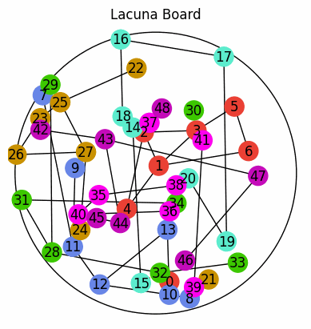

# Information for portfolio:
<!-- TODO: flowchart for portfolio -->

## Abstract
Lacuna[\[1\]](https://www.cmyk.games/products/lacuna) is a two-player,
perfect information board game where flowers are randomly distributed in a continuous space.
Players alternate turns, strategically placing their tokens to claim the most flowers.

This project explores the development and evaluation of two deep reinforcement learning (RL) agents, PPO and SAC to compete at this game. Our objective was to investigate the effectiveness of modern RL algorithms in a spatial, adversarial game setting.

The game played with random agent (Blue) against a sac agent (Red)

## Video
<iframe width="560" height="315"
src="https://www.youtube.com/watch?v=0Wa6__TQJ3M frameborder="0" allowfullscreen>
</iframe>

## Approach
We implemented two AI models, each extending from a common player base class.
As the state and action space is continious,
Deep RL algorithms were decidedly the most effective.

### Proximal Policy Optimization (PPO)[\[4\]](https://arxiv.org/abs/1707.06347)
PPO was implemented however the agent struggled to learn effective strategies in the Lacuna environment, likely due to the continuous and adversarial nature of the action space.

The model uses an Actor-Critic network to learn a policy and learn a value function respectively. For the neural networks of the PPO a first and second hidden layer size of 256 and updated its networks in batches.
The batch size was set to 2048 so after enough observations were received the network would be updated using this data and a mini-batch with size 64.

The rest of the values used for the PPO model were heuristic values used in other PPO models.

### Soft Actor-Critic (SAC)[\[3\]](https://arxiv.org/abs/1812.05905)
The SAC agent was the only agent able to improve its reward when
playing in the second players place.
It learnt more than PPO earlier on, as it has a clamping function,
designed to limit the action space to only valid output.

When against itself, both players improved their plays,
however there was some dropoff reward, likely due to the second player catching up
and making moves that limit the first.

## Results

SAC was able to undertand the rules and scope of the game significantly faster than PPO.
I think this is because having an off-policy approach allows for past learning
to be useful in the continualy developing game enviroment.
However neither agent was able to win games over over 60% of the time,
likely due to the games enherant bias towards the
first player[\[2\]](https://www.reddit.com/r/boardgames/comments/187cqiu/lacuna/).

Both agents struggled to understand the game in the earlier stages,
as they recive a large reward for winning, only on the last turn.
Future progress will try RL models that involve a backpropogating stage,
such as Monte Carlo Tree Search (MCTS)

In future development, we reccomend the following considerderations
- Implementing a descretised agent to compare against continious space agents.
- Add consideration about the mechanics and impact turn order has on the game.
- Given a game state, analysis of flower distribution might help in providing
a prediction of the winner, and key contestable clusters of flowers
    - Other interesting metrics might include which flowers are likely
    to be easy to win in both the placement and end of game phases.

## Resources
1. [Rublisher website, including rules PDF and video](https://www.cmyk.games/products/lacuna)
2. [Lacuna strategy discussion by game designer \[reddit\]](https://www.reddit.com/r/boardgames/comments/187cqiu/lacuna/)
3. [SAC implementation paper](https://arxiv.org/abs/1812.05905)
4. [PPO implementation paper](https://arxiv.org/abs/1707.06347)
